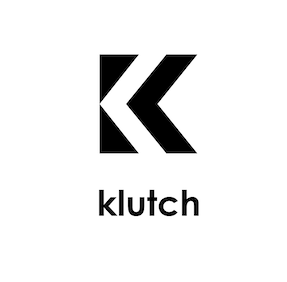

# klutch

<p align="center">
  
</p>

Table of Contents
---
- [What is Klutch?](#what-is-klutch)
- [High-Level Architecture](#high-level-architecture)
- [Getting Started](#getting-started)
  - [Prerequisites](#prerequisites)
  - [Installation](#installation)
  - [Development Set-up](#development-set-up)
- [Deployment](#deployment)
  - [Continous Integration](#continous-integration)
  - [Logging and exceptions](#logging-and-exceptions)
  - [Backend deployment](#backend-deployment)
  - [App build](#app-build)
- [Tech Stack](#tech-stack)
- [Troubleshooting](#troubleshooting)
- [Decision Log](#decision-log)
- [Authors](#authors)
- [Acknowledgments](#acknowledgments)
- [People](./team/)
- [Contributing](./contributing.md)


## What is Klutch?
Klutch is a mobile application that digitizes medical notes, with the aim of saving health professionals time and allowing them to spend it where it counts the most: patient care.

## High-Level Architecture 


## Getting Started

These instructions will get you a copy of the project up and running on your local machine for development and testing purposes. See deployment for notes on how to deploy the project on a live system.

### Prerequisites

* Android device to run the application

### Installation 
You can install a live version of the app by downloading the APK onto your android device. 

Please ensure that your device allows for downloading apks from unknown sources. If it's not, then follow this  [guide.](https://www.expressvpn.com/support/vpn-setup/enable-apk-installs-android/)

Link to APK here: <https://drive.google.com/open?id=1rA8wtZNdgu-RieI0Owev-02Sh5KPnt9U>

Please open and install the above link with your android device

### Development Set-up

1. Clone this repo
2. Navigate to the app directory: `cd klutch/app`
3. run bootstrap script: `script/bootstrap`
4. Set up backend server
5. Set up app/frontend

#### Backend Set-up
Navigate to the app/server/ directory and run the server from command line:
   ``` 
   $ npm run start:dev
   ```

#### Frontend/App Set-up
Now that Backend server is setup, we can run our app!

Navigate to the app/client directory and run the app from the command line:
        ```
        $ ionic serve --devapp
        ```

#### Debugging
Both frontend and backend environments have live reloading enabled. 

To test native features (such as camera) There are two ways to do this:

   1. Ionic DevApp
      1. Download the Ionic DevApp mobile app from Google Playstore.
      2. Make sure phone and computer are connected to the same network.
      3. Run the following command in the CLI:
        ```
        $ ionic serve --devapp
        ```
      4. Open the Ionic DevApp on your phone. Your app should show up on the homescreen. Click on it and it should launch your app. If your app still doesn't show up after a while, you can find the IP address and port number on the command line and enter them manually through the menu option. 
   2. USB debugging via Visual Studio Code. Follow this [guide](https://geeklearning.io/live-debug-your-cordova-ionic-application-with-visual-studio-code/) to live debug the app with VSC.


## Deployment
### Continous Integration 

Using Github actions we have a CI script for the frontend here, and the backend here ADD LINK

### Logging and exceptions 
Logging is implemented using LogDNA. You can view a screenshot of the dashboard [here](https://drive.google.com/open?id=1lgJzBo6tyD-u23j4glsOaeqkU3N2YFol)

Exceptions are tracked using Sentry. You can view a screenshot of the dashboard [here](https://drive.google.com/open?id=1oWjTR3NZCPBQN03FKJp9LXwT9RrCw4bF)

### Backend deployment
Done through Heroku, our backend is hosted here ```https://klucth-app.herokuapp.com/ ```

Heroku git remote: ``` https://git.heroku.com/klucth-app.git```

Push your server changes to the heroku git remote to automatically deploy your changes. 

### App build

First, make sure your your path points to the android sdk:
```
ANDROID_HOME=[path to android sdk]
```
or run the following command on your current terminal session:
```
$ export ANDROID_HOME=~/Library/Android/sdk && export PATH=${PATH}:${ANDROID_HOME}/tools && export PATH=${PATH}:${ANDROID_HOME}/platform-tools
```

You can then build the android app by following these commands
```
$ cd app/server
$ ionic cordova build android
```
An apk file will be generated in this path: ```platforms/android/app/build/outputs/apk/debug/app-debug.apk```

You can directly install it to your device using [ADB](https://developer.android.com/studio/command-line/adb?gclid=Cj0KCQiA2vjuBRCqARIsAJL5a-I7Vc9tUXbm1p5mqz2mg02VmFo_qsZ7U65t6t95rh45bkr6N7Z6E6waAt5WEALw_wcB)
```
$ adb install platforms/android/app/build/outputs/apk/debug/app-debug.apk
```


###

## Tech Stack
You can refer to the [service.yml](./service.yml) file to see where some of these services are used

* [NEST.js](https://nestjs.com/) - A progressive Node.js framework for building efficient, reliable and scalable server-side applications.
* [Ionic](https://ionicframework.com/) - Hybrid mobile application framework
* [Heroku](https://www.heroku.com) - Platform as a service (PaaS) that enables developers to build, run, and operate applications entirely in the cloud.
* [Firebase](https://firebase.google.com/docs/database) - Service that stores and syncs data with a NoSQL cloud database.
* [Google Vision API](https://cloud.google.com/vision/) - Detect texts in images using Optical Character Recognition. 
* [IBM Watson](https://cloud.ibm.com/apidocs/natural-language-understanding/natural-language-understanding?code=node#introduction) - Service that provides NLP extraction functionality from unstructured data.
* [LogDNA](https://logdna.com) - A cloud services-based server-log management and analysis tool.
* [Github Actions](https://github.com/actions) - Used to set up a CI action
* [Sentry](https://sentry.io) - Self-hosted and cloud-based error monitoring that helps software teams discover, triage, and prioritize errors in real-time.

#### Debugging tools
* [Ionic Devapp](https://play.google.com/store/apps/details?id=io.ionic.devapp&hl=en) - Used to debug ionic applications that are run on localhost
* [Android studio](https://developer.android.com/studio)- Used to build apk (application file)
* [Postman](https://www.getpostman.com/) - Quickly and easily send REST, SOAP, and GraphQL requests directly within Postman.
* [Visual Studio Code](https://code.visualstudio.com)

## Troubleshooting

* With Heroku's free plan, the site will "shut down" after a certain period of inactivity, so the first request will take some time to go through. You can avoid this by pinging https://klucth-app.herokuapp.com/ directly before testing

## Decision Log
* We decided to integrate our MVP with Cerner EHR because this is the EHR that is used by our main Subject Matter Expert.
* Third party APIs:
  * We pivoted from using Tesseract to Google Vision because the latter has a higher accuracy for OCR.
  * Instead of using another Google Service, we also pivoted to using IBM Watson for NLP, since the latter has a higher accuracy in this area.
* Backend:
  * We decided to use NestJS for our backend because it supports TypeScript, which makes it easier to align it with our frontend. Furthermore, it also provides abstraction for common Node.js frameworks (e.g., Express).
  * We also handle all third-party API calls in our backend because Google Vision and IBM Watson are not designed to be called from the client side.
* For storage and database, we decided to use Firebase because it comes with our Google API subscription. Furthermore, it employs a serverless architecture that allows real-time updates and easy retrieval of data from the client side.
* Finally, we decided to host our backend on Heroku because .... *TODO*

## Authors

* **Shawnee Rizqa** -  [shawneerizqa](https://github.com/shawneerizqa)

* **Sonata Katt** -  [sonatata](https://github.com/sonatata)

## Acknowledgments

* Julian, our CSC491 instructor, for guiding us through the process.
* Our 454 teammates [Andrea](https://github.com/andreathniah) and [Jemin](https://github.com/jeminsieow) for helping us brainstorm the idea 


