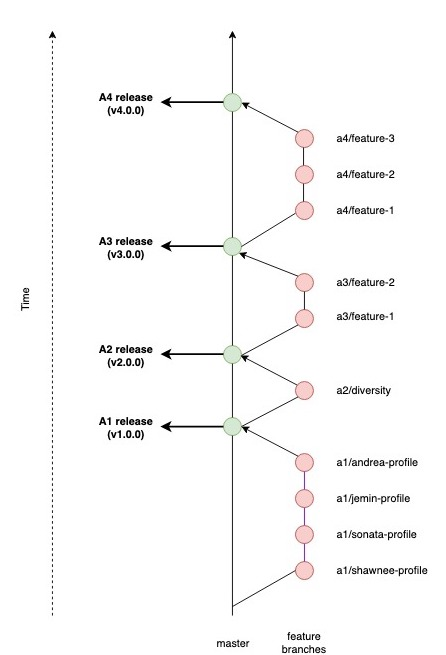

# How to Contribute to this Repository

Our company process will follow the Stable Mainline Branching Model as outlined by [this article](https://www.bitsnbites.eu/a-stable-mainline-branching-model-for-git/), with some minor modifications. Please follow this workflow and branching model whenever you push changes into this repo.

## Branches
In our simplified model, there are only two types of branches: the **master branch** and the **feature branch**. 

### Main/Master Branch
In this model, the master branch is eternal and is considered *stable*. In other words, if you check out the master branch you can expect that:

- It builds on all supported platforms/targets
- All unit tests pass
- A "standard" run of the software works

### Feature Branches
All development is done in dedicated, short-lived feature branches. This is where most of the **feature development, code review,** and **integration testing** takes place.

A feature branch branches off from master, and only once development is finished and all the integration criteria have been met, it is merged back to the master branch.

The naming convention of our feature branch adopts the following format: **a#/feature-description,** where *a#** refers to assignment number **(e.g., a1 for assignment 1),** and *feature-description* is a very short description of the purpose of the branch, including the name of the owner of the corresponding feature if applicable **(e.g., a1/shawnee-profile)**

### Release Tags
Instead of maintaining a separate release branch, we will create **Release Tags** for each release that corresponds to an assignment submission. The release tags are made in the master branch once all features are deemed ***stable***.

