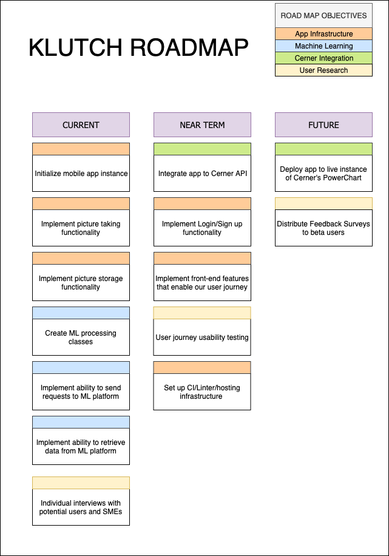

# Roadmap

For our MVP, we will be focusing on creating an application that will be ready to be integrated with Cerner, which is an EMR system that controls 23.4% of hospitals in Canada as of 2018 (Canadian Institute for Health Information, 2018). Therefore, our product roadmap will be largely influenced by Cerner’s SMART app integration process. Based on our conversation with one of Cerner’s representatives, the process is as follows:

1. We must first develop our application locally and have it ready for integration. 
2. The next step is to integrate our application with Cerner’s open-source API through OAuth and submit it for review. This is done to ensure security measures when integrating with their platform.
3. Our application will then be put through a review process by Cerner’s Business & Development teams. Once it has been approved, only then we will be granted full access to the Cerner software.
  
    **Note:** to clarify, Cerner is an enterprise application software. Therefore, getting access to their software could be challenging without buying their entire system, which could cost millions ([HIT Consultant, 2013](https://hitconsultant.net/2013/01/03/the-costly-darkside-of-emr-implementations/#.XZ1Df-dKjOR)). This is why we need to go through this process to properly get verified by Cerner. 

4. Our application will be taken through the full Cerner validation process, which includes functionality, security, user experience, and operations testing

Link to the more detailed process [here](./cerner_integration_process.md).

We decided to create our roadmap based on the [“Time Horizons”](https://www.mindtheproduct.com/growing-up-lean/) model, and we have divided our tasks into three categories:

### Current
- **What:** these are the tasks we aim to accomplish for the first version of our prototype.
- **When:** by October 31st, 2019.

### Near-term
- **What:** these are the tasks we aim to accomplish for the final MVP demo.
- **When:** by the end of November 2019.

### Future
- **What:** our long-term goals for our product.
- **When:** after the completion of the course.

This indicates that our immediate next steps would be the tasks that we put in our “Current” bucket.

## User Research
We plan on conducting user research in iterative periods, and we expect to receive more feedback as we go further down the product development cycle. We will enforce this by consulting the teaching team and our subject matter experts regularly about product decisions. Moreover, we will also keep all team members in the loop for all decision-making processes in order to collect internal feedback.

## Launch Date
Our product will be ready to launch once it has been thoroughly validated and deployed on the Cerner software. However, as we have mentioned earlier, getting to this stage involves a time-consuming process since Cerner is an established enterprise application solution. Therefore, our launch date will most likely be after the completion of this course, since it will be highly dependent on Cerner’s submission and review process.
